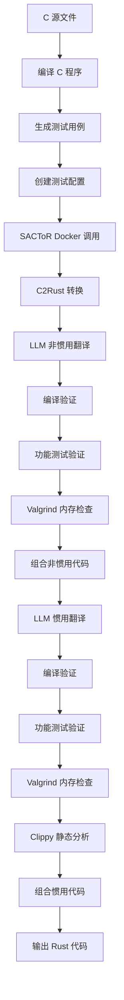

# SACToR 完整翻译流程详解

## 🔄 **整体流程概览**

```
输入 C 文件 → 预处理 → 非惯用翻译 → 组合 → 惯用翻译 → 验证 → 输出 Rust 代码
```

## 📥 **1. 输入阶段**

### **输入文件**
- **C 源文件**: `/home/changdi/sactor-datasets/Project_CodeNet/selected_data_raw/argv/s005765690.c`
- **测试配置**: `test_task.json` + `test_samples.json`

### **示例 C 文件**
```c
#include<stdio.h>
#include<stdlib.h>

int main(int argc, char* argv[]){
    int n = atoi(argv[1]);
    int i = 0;
    double s = 0;
    for(i = 0; i < n; i++){
        if(i%3 != 0 && i%5 != 0)
            s += i;
    }
    printf("%lf\n", s);
    return 0;
}
```

## 🔧 **2. 预处理阶段**

### **动态生成测试用例**
```python
def generate_correct_test_samples(c_file_path):
    # 1. 编译 C 程序
    gcc s005765690.c -o test_binary
    
    # 2. 运行获取期望输出
    ./test_binary 10  # 输出: 22.000000
    ./test_binary 5   # 输出: 7.000000
    ./test_binary 0   # 输出: 0.000000
    
    # 3. 生成测试用例
    test_samples = [
        {"input": "10", "output": "22.000000"},
        {"input": "5", "output": "7.000000"},
        {"input": "0", "output": "0.000000"}
    ]
```

### **生成测试任务文件**
```json
// test_task.json
[
    {"command": "sactor run-tests --type bin ./test_samples.json %t 0 --feed-as-args", "test_id": 0},
    {"command": "sactor run-tests --type bin ./test_samples.json %t 1 --feed-as-args", "test_id": 1},
    {"command": "sactor run-tests --type bin ./test_samples.json %t 2 --feed-as-args", "test_id": 2}
]
```

## 🤖 **3. SACToR Docker 调用**

### **Docker 命令**
```bash
docker run --rm \
  -v /home/changdi/sactor/sactor.toml:/app/sactor.toml \
  -v /tmp/translation:/tmp/translation \
  sactor translate \
  /tmp/translation/s005765690.c \
  /tmp/translation/test_task.json \
  --result-dir /tmp/translation/result \
  --type bin
```

### **SACToR 内部流程**
```python
# sactor/sactor.py
def run(self):
    # 1. 非惯用代码翻译
    result, unidiomatic_translator = self._run_unidomatic_translation()
    
    # 2. 组合非惯用代码
    combine_result, _ = self.combiner.combine(
        "translated_code_unidiomatic", is_idiomatic=False
    )
    
    # 3. 惯用代码翻译
    result, idiomatic_translator = self._run_idiomatic_translation()
    
    # 4. 组合惯用代码
    combine_result, _ = self.combiner.combine(
        "translated_code_idiomatic", is_idiomatic=True
    )
```

## 🔄 **4. 翻译阶段**

### **4.1 非惯用翻译**
**目标**: 直接翻译 C 代码，保持相似结构

**过程**:
1. **C2Rust 转换**: 使用 C2Rust 工具进行初步转换
2. **LLM 优化**: 使用 LLM 修复编译错误和类型问题
3. **验证**: 编译验证 + 功能测试验证

**输出**:
```rust
// translated_code_unidiomatic/combined.rs
pub fn main() -> () {
    use std::env;
    use std::ffi::CString;
    use libc::atoi;
    
    let args: Vec<String> = env::args().collect();
    let c_arg = CString::new(args[1].clone()).expect("CString::new failed");
    let n = unsafe { atoi(c_arg.as_ptr()) };
    
    let mut s: f64 = 0.0;
    for i in 0..n {
        if i % 3 != 0 && i % 5 != 0 {
            s += i as f64;
        }
    }
    println!("{:.6}", s);
}
```

### **4.2 惯用翻译**
**目标**: 转换为符合 Rust 习惯的代码，移除 unsafe

**过程**:
1. **LLM 重构**: 使用 LLM 将非惯用代码转换为惯用代码
2. **安全化**: 移除 unsafe 块，使用 Rust 原生方法
3. **验证**: 编译验证 + 功能测试验证

**输出**:
```rust
// translated_code_idiomatic/combined.rs
pub fn main() {
    use std::env;
    
    let args: Vec<String> = env::args().collect();
    let n: i32 = match args[1].parse() {
        Ok(num) => num,
        Err(_) => {
            eprintln!("Error: Please provide a valid integer.");
            return;
        }
    };
    
    if n <= 0 {
        println!("{:.6}", 0.0);
        return;
    }
    
    let s: f64 = (0..n)
        .filter(|&i| i % 3 != 0 && i % 5 != 0)
        .map(|i| i as f64)
        .sum();
    
    println!("{:.6}", s);
}
```

## 🧪 **5. 验证阶段**

### **5.1 编译验证**
```bash
# 编译 Rust 代码
cargo build --manifest-path Cargo.toml

# 检查编译结果
if cargo build succeeds:
    compilation_result = SUCCESS
else:
    compilation_result = FAILED
```

### **5.2 功能验证**
```bash
# 运行测试用例
sactor run-tests --type bin ./test_samples.json target_binary 0 --feed-as-args
sactor run-tests --type bin ./test_samples.json target_binary 1 --feed-as-args
sactor run-tests --type bin ./test_samples.json target_binary 2 --feed-as-args

# 比较输出
actual_output = "22.000000"
expected_output = "22.000000"
if actual_output == expected_output:
    test_result = PASSED
else:
    test_result = FAILED
```

### **5.3 内存验证 (Valgrind)**
```bash
# 使用 Valgrind 检查内存泄漏
valgrind --tool=memcheck --leak-check=full target_binary 10

# 检查结果
if no memory leaks:
    memory_result = CLEAN
else:
    memory_result = LEAKS_DETECTED
```

### **5.4 静态分析 (Clippy)**
```bash
# 运行 Rust Clippy 静态分析
cargo clippy --manifest-path Cargo.toml

# 检查警告和错误
if no warnings:
    clippy_result = CLEAN
else:
    clippy_result = WARNINGS_FOUND
```

## 📊 **6. 验证结果汇总**

### **验证标准**
```python
verification_results = {
    'unidiomatic': {
        'compilation': True/False,
        'functionality': True/False,
        'memory': True/False,
        'clippy': True/False
    },
    'idiomatic': {
        'compilation': True/False,
        'functionality': True/False,
        'memory': True/False,
        'clippy': True/False
    },
    'overall': True/False  # 所有验证都通过
}
```

### **成功标准**
- ✅ **编译成功**: Rust 代码能够成功编译
- ✅ **功能正确**: 所有测试用例都通过
- ✅ **内存安全**: Valgrind 检查无内存泄漏
- ✅ **代码质量**: Clippy 检查无警告

## 📁 **7. 输出阶段**

### **输出文件结构**
```
/tmp/translation/result/
├── translated_code_unidiomatic/
│   ├── combined.rs          # 非惯用 Rust 代码
│   ├── Cargo.toml           # 项目配置
│   └── target/              # 编译输出
├── translated_code_idiomatic/
│   ├── combined.rs          # 惯用 Rust 代码
│   ├── Cargo.toml           # 项目配置
│   └── target/              # 编译输出
├── unidiomatic_failure_info.json  # 非惯用翻译失败信息
├── idiomatic_failure_info.json    # 惯用翻译失败信息
└── llm_stat.json                   # LLM 使用统计
```

### **最终结果**
```json
{
    "success": true,
    "verification": {
        "unidiomatic": {"success": true, "details": {...}},
        "idiomatic": {"success": true, "details": {...}},
        "overall": true
    },
    "test_count": 3,
    "result_dir": "/tmp/translation/result"
}
```

## 🔄 **8. 完整流程图**



## 🎯 **关键特点**

1. **双重翻译**: 非惯用 → 惯用，确保代码质量
2. **多层验证**: 编译 + 功能 + 内存 + 静态分析
3. **动态测试**: 自动生成测试用例，确保准确性
4. **完整流程**: 从 C 到 Rust 的端到端转换
5. **质量保证**: 多重验证确保翻译质量
